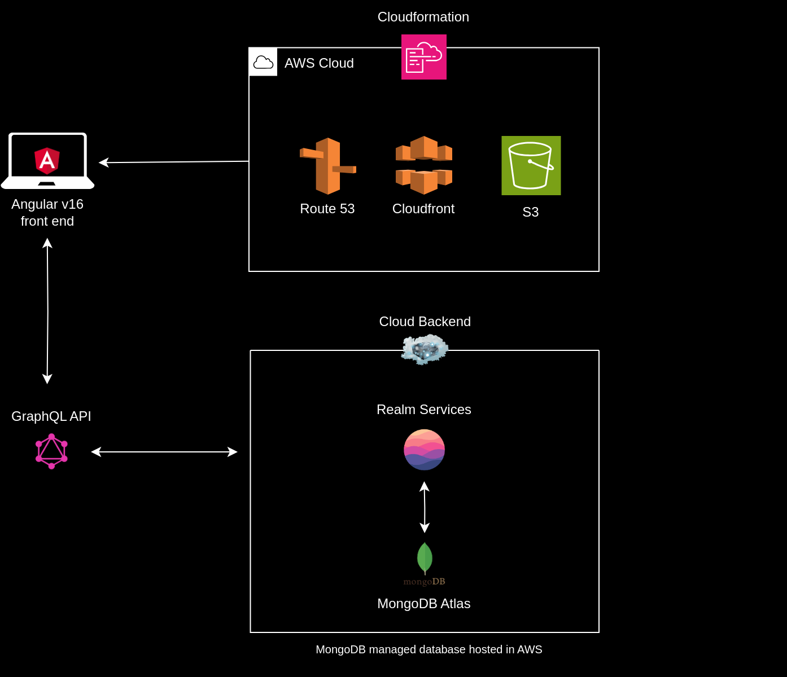

# ACS Tracker

 &nbsp;&nbsp;&nbsp;&nbsp;  &nbsp;&nbsp;&nbsp;&nbsp;  

Visit here: https://acs-tracker.com

If you've ever applied for a skills assessment from the Australian Computer Society, you have probably faced the same question I did - how long will my application take to process? 

While the official website states a general waiting time of 8-12 weeks, individual cases often vary based on each person's circumstances. Wouldn't it be great if you could see the current trends in processing times at a glance, shared directly by other applicants themselves?

### Motivation

As of the time of writing this, the main sources of information about ACS skills assessments are the [ACS Skills Assessment for PR Facebook group](https://www.facebook.com/groups/acs4pr) and the [AusVisa subreddit](https://www.reddit.com/r/AusVisa/).

However, there is no consistent format to this data, as some may choose to omit crucial details such as the ANZSCO code they applied under, or the chosen stream. It is also not convenient to always scroll through a large number of posts seeking help or discussing other aspects of the process just to find the ones that shed light on waiting times.

Other options include [ImmiTracker](https://myimmitracker.com/) or [TrackItt](https://www.trackitt.com/australia-immigration-trackers/skills-assessment), both of which necessitate signing up and creating a user profile. ImmiTracker's data on ACS skills assessments is also not as exhaustive as its base of users who post about General Skilled Migration (GSM) visa applications.

### Solution

The idea for this application was conceived during the interminable wait between submitting my own skills assessment application and receiving a response. With this tracker, I wanted to create a web app that would convey critical information on current wait times based on aggregated user responses from those who have already received a result - either positive or negative. 

The data is presented in a tabular format, sorted in order of the date of receiving a result - latest to oldest. Users who wish to share their own experience can log their application details through a simple form that takes no more than a minute to complete. No personal information is required.

## Architecture

## Roadmap

Planned improvements for the app include:

* Graphs to visualise the latest trends - requires more data to draw meaningful conclusions (at least 50 entries). This can present processing times in a similar format to the Department of Home Affairs (90% processed in x weeks, 75% processed in y weeks, and so on)
* Misc bug fixes and performance improvements

## Contributing

Please open an issue if you wish to suggest a major feature, or alternatively send me an email at [soham.sevak@gmail.com](mailto:soham.sevak@gmail.com) with the request.

You are welcome to clone the repo and open a pull request if you would like to submit your own additions.

### Additional Notes

This web app was built using Angular v16, and the backend leverages MongoDB Atlas, a fully managed cloud database solution that also provides easy access to data via APIs that take away the need to manage our own server.

It is hosted using AWS S3 and Cloudfront to provide secure static website hosting at a low cost. 

## Disclaimer

**Neither the application nor its creator claim any affiliation with or endorsement via the Australian Computer Society, Incorporated. This is a standalone application developed as an open-source project to provide applicants with better data regarding current processing timelines. No infringement of the term 'Australian Computer Society' is intended by its use in the application title, whose ownership rests solely with the aforementioned organisation.**

**Neither the application nor its creator claim to offer any migration advice - contact a registered migration agent if you wish to seek professional help for your skills assessment application.**